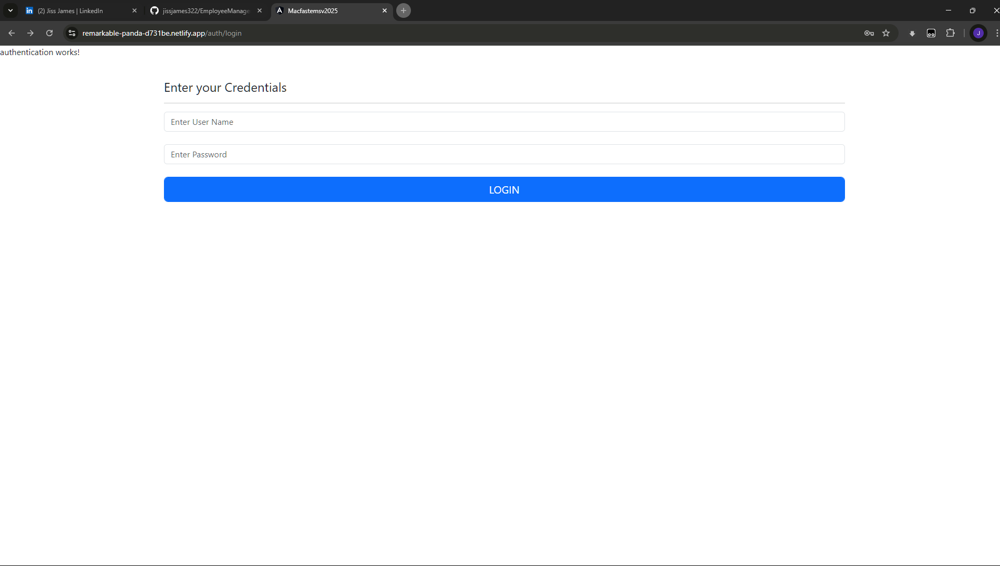
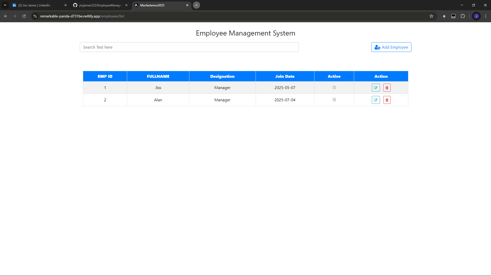
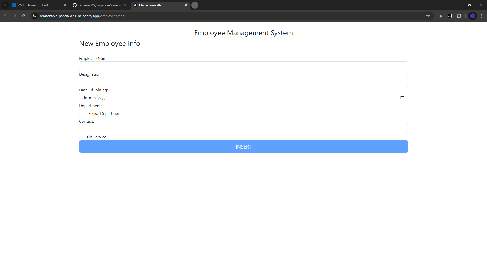
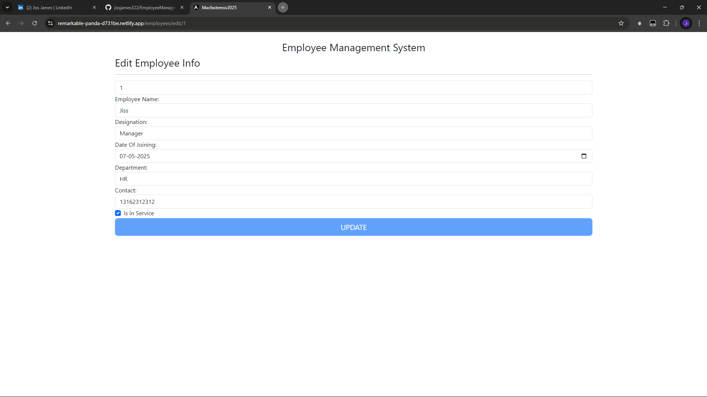

# 🏢 Employee Management System (EMS)

A full-stack Employee Management System built using **Django + MySQL** for the backend and **Angular** for the frontend. This application allows admin users to manage employee records, including CRUD operations, authentication, and role-based access, with a responsive and interactive UI.

---

## 🚀 Features

- 🔐 User authentication & authorization
- 👨‍💼 Employee management (Create, Read, Update, Delete)
- 📅 Department & role assignment
- 🔍 Search & filter functionality
- 🧾 RESTful APIs with Django REST Framework
- 🌐 Fully responsive Angular frontend
- 🛡️ Role-based access control (Admin, Staff, etc.)

---

## Demo

[](https://emsfaith.netlify.app/)

## 🧱 Tech Stack


### Backend – Django

- Django 4.x
- Django REST Framework
- MySQL Database
- JWT / Session-based Authentication
- CORS setup for frontend-backend communication

### Frontend – Angular

- Angular 15+ (SPA)
- Angular Material (for UI components)
- RxJS & Reactive Forms
- HTTP Client for API communication

---

## ⚙️ Getting Started

### ✅ Prerequisites

- Python 3.10+
- Node.js & npm
- MySQL Server
- Angular CLI

---

### 📦 Backend Setup (Django)

1. Navigate to the backend directory:

   ```bash
   cd backend
   ```

2. Create virtual environment and install dependencies:

   ```bash
   python -m venv venv
   source venv/bin/activate  # On Windows: venv\Scripts\activate
   pip install -r requirements.txt
   ```

3. Set environment variables or update `settings.py` for DB credentials:

   ```python
   DATABASES = {
       'default': {
           'ENGINE': 'django.db.backends.mysql',
           'NAME': 'your_db_name',
           'USER': 'your_db_user',
           'PASSWORD': 'your_db_password',
           'HOST': 'your_db_host',
           'PORT': '3306',
       }
   }
   ```

4. Run migrations and start the server:

   ```bash
   python manage.py migrate
   python manage.py runserver
   ```

---

### 🌐 Frontend Setup (Angular)

1. Navigate to the frontend directory:

   ```bash
   cd frontend
   ```

2. Install dependencies:

   ```bash
   npm install
   ```

3. Update API base URL in `environment.ts`:

   ```ts
   export const environment = {
     production: false,
     apiUrl: 'http://localhost:8000/api' // Or your backend domain
   };
   ```

4. Run Angular development server:

   ```bash
   ng serve
   ```

---

## 🖼️ Screenshots

> Add your UI screenshots here later. Example layout:

| Login Page | List Employee | Add Employee | Edit Employee |
|------------|-----------|-----------|---------------|
|  | |  |  |

---

## 📜 API Endpoints (Sample)

| Method | Endpoint             | Description           |
|--------|----------------------|-----------------------|
| GET    | /api/employees/list      | List all employees    |
| POST   | /api/employees/add      | Create new employee   |
| PUT    | /api/employees/edit:id/  | Update employee       |
| DELETE | /api/employees/:id/  | Delete employee       |

---

## 🧑‍💻 Contributing

Contributions are welcome! Please fork the repository and submit a pull request.


---

## 🙌 Acknowledgements

- [Django Documentation](https://docs.djangoproject.com/)
- [Angular Documentation](https://angular.io/docs)
- [MySQL Documentation](https://dev.mysql.com/doc/)
